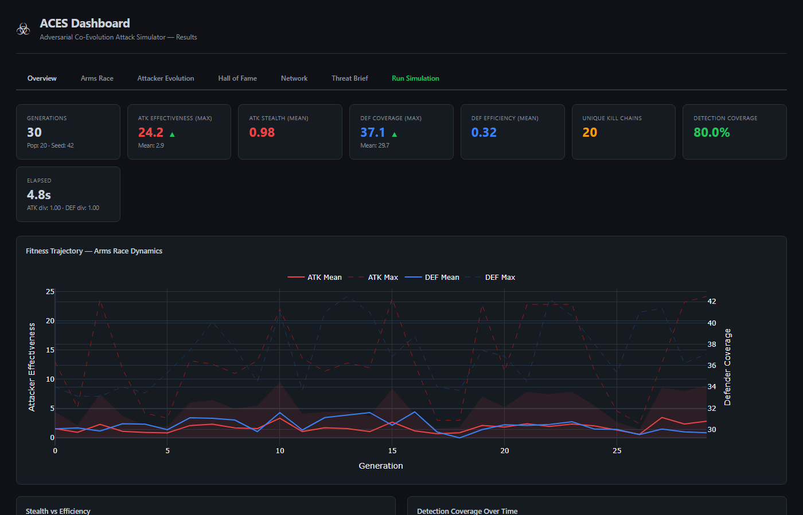
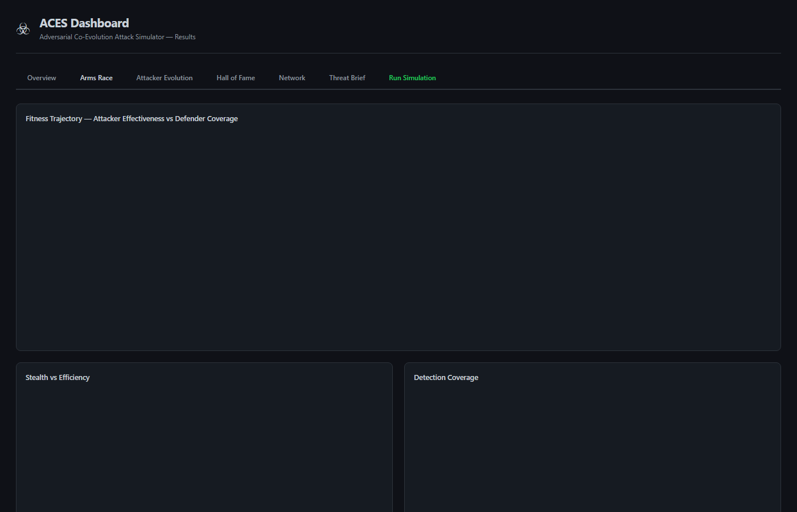
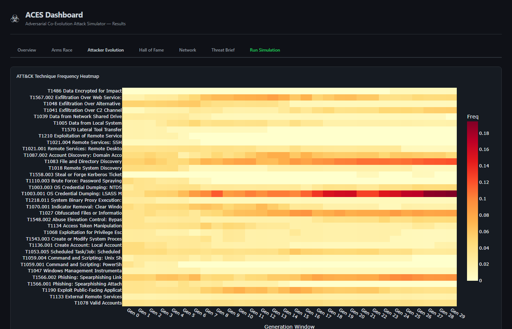
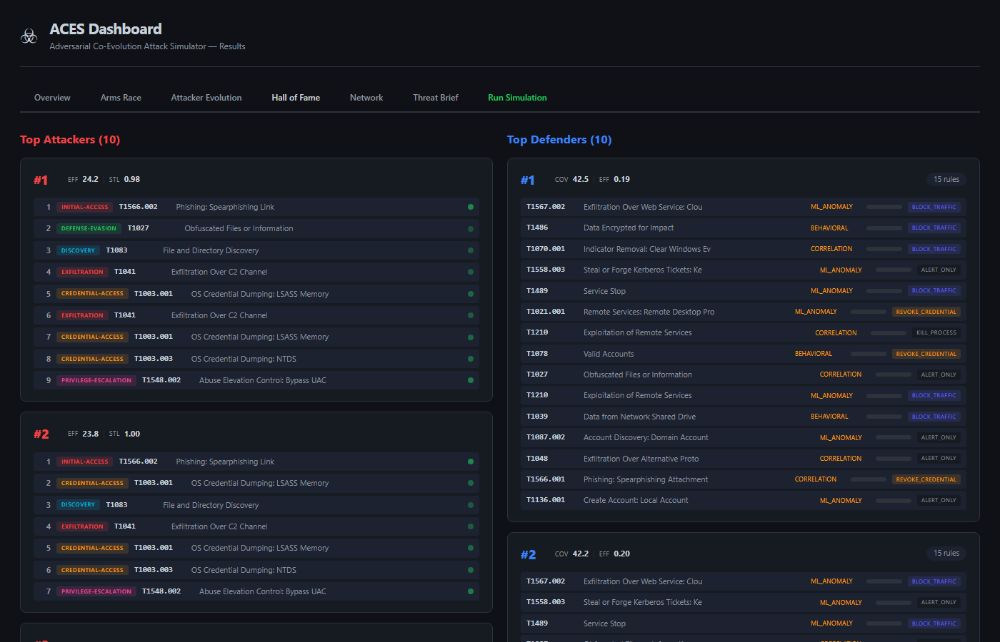
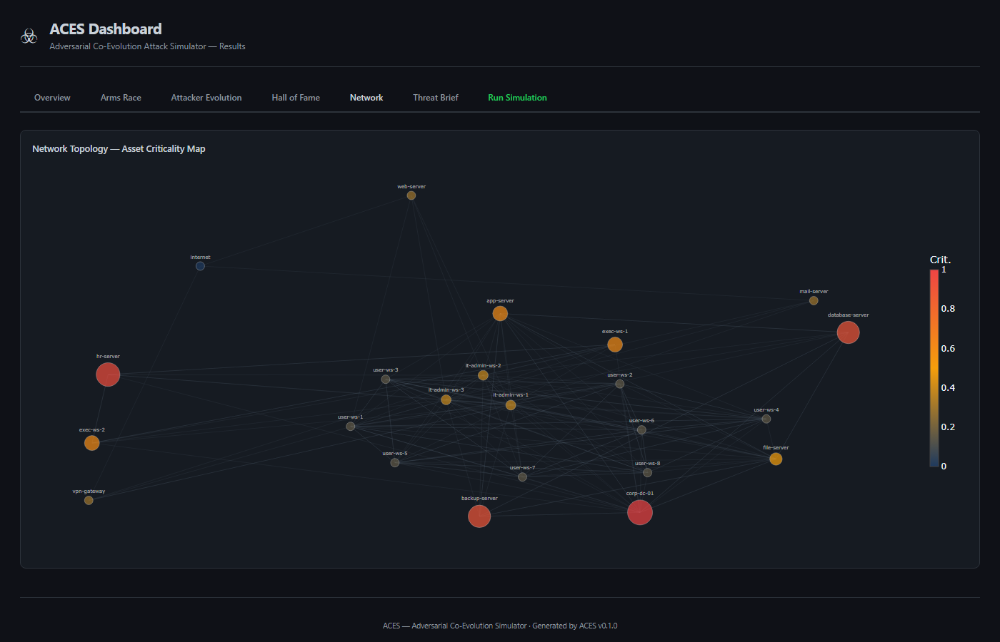
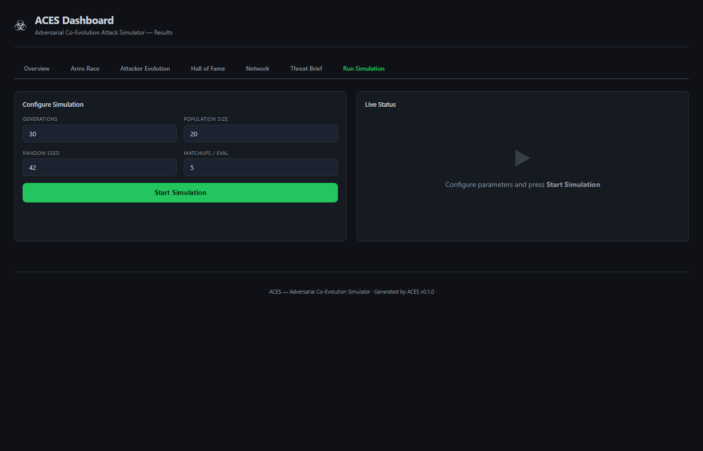
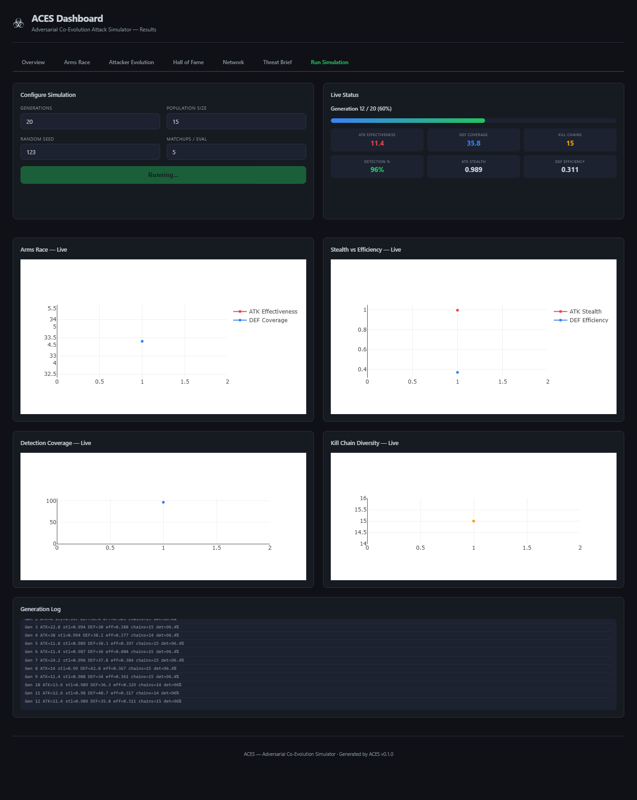
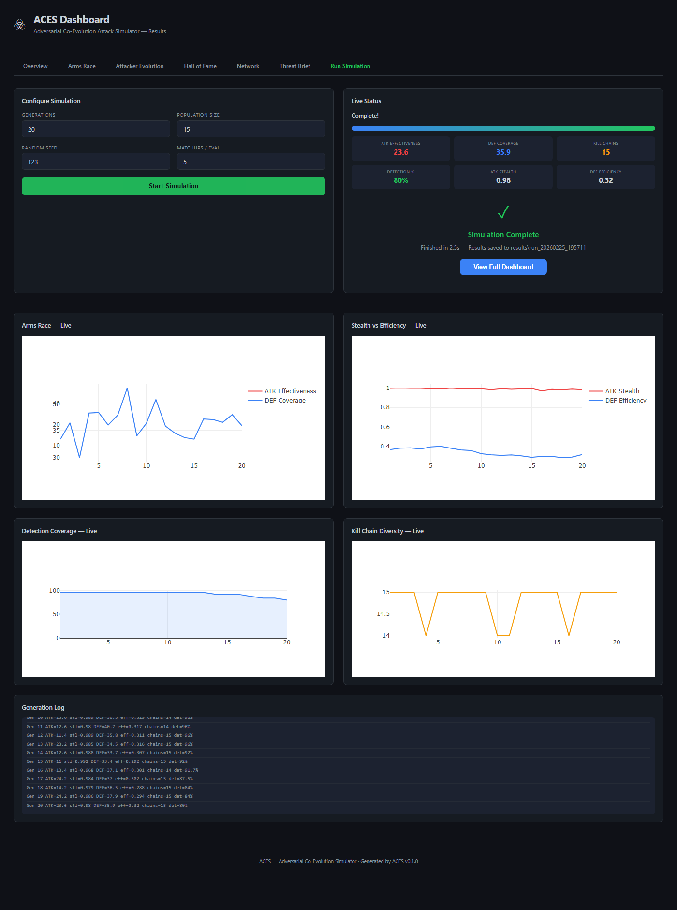

# ACES — Adversarial Co-Evolution Attack Simulator

A cybersecurity research framework that co-evolves offensive and defensive AI agents using genetic algorithms and MITRE ATT&CK. Attackers discover increasingly sophisticated kill chains; defenders evolve surgical detection strategies in response. The arms race runs for hundreds of generations, producing emergent threat patterns and Pareto-optimal defense portfolios — without human-authored playbooks.

Traditional breach-and-attack simulation (BAS) tools replay known attack patterns. Real adversaries adapt — so defenders need systems that force adaptation through competitive pressure. ACES demonstrates this principle: over hundreds of generations, offensive agents discover novel kill chains while defensive agents evolve correlated detection capabilities, producing an observable arms race dynamic.

---

## Screenshots

| Dashboard Overview | Arms Race Dynamics |
|---|---|
|  |  |

| Attacker Evolution | Hall of Fame |
|---|---|
|  |  |

| Network Topology | Threat Brief |
|---|---|
|  |  |

| Live Simulation | Live Running | Run Complete |
|---|---|---|
|  |  |  |

---

## What It Does

```
┌─────────────────────────────────────────────────────────────┐
│                    Corporate Network (25 nodes)              │
│  Internet → DMZ (web/mail/VPN) → Corp LAN → Restricted      │
│  Domain Controllers · Databases · Workstations · Servers    │
└──────────────────────┬──────────────────────────────────────┘
                       │ simulate matchups
          ┌────────────┴────────────┐
          ▼                         ▼
  ┌───────────────┐         ┌───────────────┐
  │  Attacker Pop │         │  Defender Pop │
  │  NSGA-II EA   │◄───────►│  NSGA-II EA   │
  │               │  arms   │               │
  │  Kill chains  │  race   │  Detection    │
  │  of ATT&CK    │         │  rule sets    │
  │  techniques   │         │  w/ responses │
  └───────────────┘         └───────────────┘
          │                         │
          └────────────┬────────────┘
                       ▼
              ┌─────────────────┐
              │  Fitness scores  │
              │  Pareto fronts   │
              │  Hall of Fame    │
              │  Threat brief    │  ← Claude Sonnet
              └─────────────────┘
```

Each generation, attackers are scored on **effectiveness** (criticality-weighted compromise, credential harvest, exfiltration) and **stealth** (evasion of detection). Defenders are scored on **coverage** (detection + response rate) and **efficiency** (low false-positive load, budget utilization). NSGA-II selection preserves diversity across both objectives simultaneously.

---

## Features

- **38 MITRE ATT&CK techniques** across 11 tactics — each with realistic preconditions, effects, success rates, and data sources
- **25-node simulated network** — segmented corporate topology with DMZ, workstations, domain controllers, databases, and restricted hosts; realistic vulnerability and credential distributions
- **Multi-objective co-evolution (NSGA-II)** — attackers and defenders each maintain Pareto-optimal populations across two competing fitness objectives
- **Variable-length attacker genomes** — ordered kill chains with target selectors (highest criticality, least defended, most connected, random) and stealth modifiers per gene
- **Budget-constrained defender genomes** — unordered detection rule sets with confidence levels, false positive rates, and response actions (isolate host, revoke credential, kill process)
- **Stagnation recovery** — automatic detection of fitness plateaus with random immigrant injection to restore gradient
- **Hall of Fame + elitism** — top-N individuals from both populations persist across generations; used as evaluation opponents to mitigate Red Queen cycling
- **6 interactive Plotly visualizations** — fitness trajectories, technique heatmaps, detection coverage, attack diversity, Pareto snapshots, network compromise heatmap
- **Live web dashboard** — real-time browser UI with live charts, generation log, and configurable simulation parameters via built-in HTTP server with SSE streaming
- **LLM narration** — optional Claude Sonnet integration generates strategic threat briefs from evolved Hall of Fame patterns
- **43 tests, all passing**

---

## Quick Start

### Install

```bash
git clone <repo>
cd adversarium
pip install -e .
```

For LLM narration (optional):

```bash
pip install -e ".[narration]"
export ANTHROPIC_API_KEY=sk-ant-...
```

### Run a basic simulation

```bash
python examples/run_basic.py
```

Default: 300 generations, population 80, 5 matchups per evaluation, seed 42. Results saved to `results/run_<timestamp>/`.

### Run with LLM narration

```bash
python examples/run_with_narration.py
```

Requires `ANTHROPIC_API_KEY`. Appends an LLM-generated `threat_brief.md` to the output directory.

### Run the live web dashboard

```bash
python examples/run_server.py
```

Opens a browser with real-time simulation controls, live fitness charts, and a generation log. Configure population size, generations, and mutation rates from the UI.

### Analyze existing results

```bash
python examples/analyze_results.py results/run_<timestamp>/
```

### Run tests

```bash
python -m pytest tests/ -v
```

---

## Architecture

### Design Philosophy

Three principles guide every architectural decision:

1. **Co-evolution, not optimization.** Both populations evolve against each other. Fitness is always relative — an attacker's score depends on which defenders it faces, and vice versa. This creates the arms race dynamic that is the project's central demonstration.

2. **Operational realism over simulation fidelity.** The network graph captures reachability, vulnerability, and privilege relationships — not packet-level simulation. This keeps the simulation fast enough to run hundreds of generations in minutes.

3. **ATT&CK as the lingua franca.** Every attack technique and detection rule maps to real MITRE ATT&CK identifiers, ensuring evolved strategies are interpretable by security practitioners.

### System Overview

```
┌─────────────────────────────────────────────────────────────────┐
│                    Co-Evolution Orchestrator                     │
│                     (evolution/coevolution.py)                   │
│                                                                  │
│  ┌──────────────┐    Tournament     ┌──────────────┐            │
│  │   Attacker    │◄──Matchups──────►│   Defender    │            │
│  │  Population   │                  │  Population   │            │
│  │  (80 genomes) │                  │  (80 genomes) │            │
│  └──────┬───────┘                   └──────┬───────┘            │
│         │                                   │                    │
│         └───────────┐       ┌───────────────┘                    │
│                     ▼       ▼                                    │
│              ┌──────────────────┐                                │
│              │ Simulation Engine │                                │
│              │  (simulation/     │                                │
│              │   engine.py)      │                                │
│              └────────┬─────────┘                                │
│                       │                                          │
│                       ▼                                          │
│              ┌──────────────────┐                                │
│              │  Network Graph   │   ◄── Cloned per matchup       │
│              │  (Digital Twin)  │       (mutable simulation      │
│              │                  │        state)                   │
│              └──────────────────┘                                │
│                       │                                          │
│                       ▼                                          │
│              ┌──────────────────┐                                │
│              │  Scoring Engine  │   ◄── Produces fitness tuples  │
│              │  (simulation/    │       for both attacker and    │
│              │   scoring.py)    │       defender                 │
│              └──────────────────┘                                │
│                       │                                          │
│         ┌─────────────┴─────────────┐                            │
│         ▼                           ▼                            │
│  ┌──────────────┐           ┌──────────────┐                    │
│  │   Selection   │           │   Selection   │                   │
│  │   Crossover   │           │   Crossover   │                   │
│  │   Mutation    │           │   Mutation    │                   │
│  │  (attackers)  │           │  (defenders)  │                   │
│  └──────────────┘           └──────────────┘                    │
│                                                                  │
│  ┌──────────────────────────────────────────────────────────┐   │
│  │  Metrics Collector (evolution/metrics.py)                 │   │
│  │  - Per-generation fitness stats (mean, max, min, stdev)   │   │
│  │  - Technique frequency distributions                      │   │
│  │  - Genome diversity (Hamming distance within population)  │   │
│  │  - Hall of Fame updates                                   │   │
│  └──────────────────────────────────────────────────────────┘   │
└─────────────────────────────────────────────────────────────────┘
                          │
                          ▼
              ┌──────────────────────┐
              │  Post-Run Analysis   │
              │  - LLM Narration     │
              │  - Visualization     │
              │  - Results Export     │
              └──────────────────────┘
```

### Network Layer

The 25-node corporate topology is generated by `TopologyGenerator.corporate_medium()`:

```
EXTERNAL (internet)
    │
┌───┴───┐
│  DMZ   │ ── web-server, mail-server, vpn-gateway
└───┬───┘
    │
┌───┴───────────────────────────────┐
│          CORPORATE LAN             │
│  ┌─────────┐  ┌─────────────┐     │
│  │ User     │  │ IT/Admin    │     │
│  │ Segment  │  │ Segment     │     │
│  │ 8 ws     │  │ 3 ws       │     │
│  └────┬─────┘  └──────┬──────┘     │
│       │               │             │
│  ┌────┴───────────────┴──────┐     │
│  │      Server Segment        │     │
│  │  DC, file-srv, app-srv,    │     │
│  │  db-srv, backup-srv        │     │
│  └────────────────────────────┘     │
│                                     │
│  ┌────────────────────────────┐     │
│  │   Restricted Segment       │     │
│  │   exec-ws-1, exec-ws-2,    │     │
│  │   hr-srv (PII data)        │     │
│  └────────────────────────────┘     │
└─────────────────────────────────────┘
```

**Segments and reachability:**
- DMZ hosts reachable from external on specific ports
- User segment can reach server segment via SMB, HTTP
- IT segment can reach everything via RDP, SSH, SMB
- Server segment hosts can reach each other
- Restricted segment only reachable from IT segment
- DC reachable from all internal segments via LDAP/Kerberos

**Critical assets** (criticality 0.9-1.0): Domain Controller, Database server, HR server (PII), Backup server. **Medium** (0.4-0.6): App server, file server, executive workstations. **Low** (0.1-0.3): User workstations, DMZ servers.

Hosts carry `Service`, `Vulnerability`, and `Credential` models. `NetworkGraph` wraps a `networkx.DiGraph` with reachability queries, credential harvesting, and host compromise tracking.

### Data Models

All models use Pydantic v2 for validation and serialization.

```
Host
├── id, hostname, os (WINDOWS_10, UBUNTU_22, RHEL_8, etc.)
├── role (WORKSTATION, SERVER, DOMAIN_CONTROLLER, FIREWALL, DATABASE)
├── criticality: float [0.0-1.0]
├── services: list[Service]       # name, port, version, exposed
├── vulnerabilities: list[Vuln]   # cve_id, cvss_score, technique_enables
├── is_compromised, privilege_level, has_credential_cache
└── installed_software: list[str]

NetworkGraph (wraps networkx.DiGraph)
├── hosts: dict[str, Host]
├── edges with protocols, credential requirements, segment boundaries
├── segments: dict[str, list[str]]
├── credentials: dict[str, Credential]
└── methods: clone(), get_reachable(), compromise_host(), harvest_credentials()
```

### Genome Representations

**Attackers** encode ordered kill chains as a list of `AttackGene` objects:
- `technique_id` — MITRE ATT&CK ID (e.g. `T1190`)
- `target_selector` — strategy for picking a target host (`HIGHEST_CRITICALITY`, `LEAST_DEFENDED`, `MOST_CONNECTED`, `RANDOM_REACHABLE`, `SPECIFIC_ROLE`)
- `stealth_modifier` — float `[0,1]` reducing detection probability
- `fallback_technique` — alternative if preconditions fail

Invariant: `genes[0]` must be an Initial Access technique. Variable-length genomes allow a 3-step smash-and-grab to compete with a 10-step low-and-slow campaign.

**Defenders** encode unordered detection rule sets as a list of `DetectionGene` objects:
- `technique_detected` — which ATT&CK technique this rule targets
- `data_source` — telemetry source (Process Creation, Network Traffic, Authentication Log, etc.)
- `detection_logic` — `SIGNATURE` (precise, brittle), `BEHAVIORAL` (robust, noisy), `CORRELATION` (expensive, high-value), `ML_ANOMALY` (adaptive)
- `confidence` — detection probability `[0,1]`
- `false_positive_rate` — operational noise cost
- `response_action` — `ISOLATE_HOST | REVOKE_CREDENTIAL | KILL_PROCESS | ALERT_ONLY | BLOCK_TRAFFIC`
- `deploy_cost` — budget units consumed

Invariant: total `deploy_cost` <= `defender_budget`.

### Simulation Engine

For each matchup, `SimulationEngine.simulate()` executes the attacker's kill chain against the defender's rule set on a cloned network:

1. Resolve target host via `target_selector`
2. Check technique preconditions (position, privilege, required service/vuln/credential)
3. If preconditions fail, try `fallback_technique` or log `PRECONDITION_FAILURE`
4. Roll defender detection: `confidence * (1 - stealth_modifier)`
5. If detected, execute `response_action` (isolate host, revoke credential, etc.)
6. If undetected, apply technique effects (compromise host, harvest credentials, establish persistence, exfiltrate data)
7. Log `SimEvent` with full outcome

### Fitness Functions

**Attacker fitness** (multi-objective — effectiveness, stealth):
```
effectiveness = mean across matchups of:
    sum(host.criticality for host in compromised_hosts) * 10
    + credentials_obtained * 3
    + (50 if data_exfiltrated else 0)
    + kill_chain_length * 2

stealth = mean across matchups of:
    1.0 - (techniques_detected / max(techniques_attempted, 1))
```

**Defender fitness** (multi-objective — coverage, efficiency):
```
coverage = mean across matchups of:
    techniques_detected / max(techniques_attempted, 1) * 50
    + attacks_prevented_by_response * 10
    + (30 if not data_exfiltrated else 0)

efficiency =
    1.0 / (1.0 + total_false_positive_load)
    * (1.0 - rules_deployed / budget)
```

**Why multi-objective matters:** Single-objective fitness causes population collapse — attackers converge on the single most damaging chain, defenders converge on the single best counter. NSGA-II Pareto ranking preserves diverse strategies: the Pareto front of attackers shows both "loud but devastating" and "quiet but persistent" lineages. The Pareto front of defenders shows both "comprehensive but noisy" and "surgical but limited" lineages.

### Co-Evolution Loop

Each generation:
1. Evaluate each attacker against `matchups_per_eval` sampled defenders + HOF sample
2. Evaluate each defender against `matchups_per_eval` sampled attackers + HOF sample
3. Collect `GenerationMetrics` (fitness stats, technique frequencies, diversity)
4. Update attacker and defender Hall of Fame
5. NSGA-II tournament selection -> crossover -> mutation -> new population
6. Elitism: inject HOF individuals back into population
7. Stagnation check: if max fitness flat for `stagnation_window` generations, inject random immigrants

**Known failure modes and mitigations:**
- **Red Queen cycling** (populations oscillate without improving) — mitigated by Hall of Fame evaluation
- **Mediocre stable states** (local equilibrium) — mitigated by random immigrant injection on stagnation
- **Loss of gradient** (one population dominates completely) — mitigated by multi-objective fitness preserving diverse strategies

### Genetic Operators

**Attacker crossover:** Single-point crossover on gene sequences. Always preserves initial access gene at position 0. Truncates to `max_attack_chain_length`.

**Attacker mutation** (one of): add gene, remove gene, swap gene positions, change technique (same tactic), change target selector, perturb stealth modifier.

**Defender crossover:** Uniform crossover — pool all genes, each has 50% chance per child. Trim to budget, remove duplicates.

**Defender mutation** (one of): add detection rule, remove rule, change detection logic type, tune confidence, change response action, retarget to different technique.

---

## ATT&CK Techniques

38 techniques across 11 tactics are modeled with full preconditions, effects, data sources, and detection mappings.

| Tactic | Count | Techniques |
|--------|-------|------------|
| Initial Access | 5 | T1190 (Exploit Public App), T1566.001/002 (Phishing), T1133 (External Remote Services), T1078 (Valid Accounts) |
| Execution | 3 | T1059.001 (PowerShell), T1059.004 (Unix Shell), T1047 (WMI) |
| Persistence | 3 | T1053.005 (Scheduled Task), T1543.003 (Windows Service), T1136.001 (Create Local Account) |
| Privilege Escalation | 3 | T1068 (Exploitation), T1548.002 (Bypass UAC), T1134 (Token Manipulation) |
| Defense Evasion | 3 | T1070.001 (Clear Event Logs), T1027 (Obfuscated Files), T1218.011 (Rundll32 Proxy Execution) |
| Credential Access | 4 | T1003.001 (LSASS Dump), T1003.003 (NTDS), T1558.003 (Kerberoasting), T1110.003 (Password Spraying) |
| Discovery | 3 | T1018 (Remote System Discovery), T1083 (File/Dir Discovery), T1087.002 (Domain Account Discovery) |
| Lateral Movement | 5 | T1021.001 (RDP), T1021.002 (SMB), T1021.004 (SSH), T1570 (Lateral Tool Transfer), T1210 (Exploit Remote Services) |
| Collection | 2 | T1005 (Local System Data), T1039 (Network Share Data) |
| Exfiltration | 3 | T1048 (Alt Protocol), T1041 (C2 Channel), T1567.002 (Cloud Storage) |
| Impact | 2 | T1486 (Data Encrypted for Impact), T1489 (Service Stop) |

Each technique models:
- **Preconditions** — position (external/internal/on-host), privilege level, required services, vulnerabilities, or credentials
- **Effects** — foothold, privilege escalation, credential harvest, persistence, lateral movement, data exfiltration
- **Base success rate** — reflects real-world reliability (e.g., phishing at 0.35, valid accounts at 0.90)
- **Stealth base** — inherent detectability (e.g., LSASS dump at 0.3, valid accounts at 0.9)
- **Data sources** — what telemetry can detect this technique (Process Creation, Network Traffic, Authentication Log, etc.)

### Detection Data Sources

| Data Source | Example Detectable Techniques | Typical FP Rate |
|---|---|---|
| Process Creation | PowerShell, WMI, Scheduled Task, UAC Bypass, Rundll32 | Medium |
| Authentication Log | Valid Accounts, Remote Services, Kerberoasting, Password Spraying | Low |
| Network Traffic | Exploit Public App, Lateral Movement, Exfiltration | High |
| File Access/Creation | Phishing Attachment, Local Data, NTDS, Obfuscation | Medium |
| LSASS Process Access | T1003.001 (LSASS Dump) | Very Low |
| Email Gateway | Phishing (Attachment + Link) | Medium |

Defenders evolve to select which data sources to monitor and what detection logic to apply. A defender that monitors Network Traffic for everything will have high coverage but crippling false positive load — evolution discovers that targeted, low-FP detections are more efficient.

---

## Configuration

All parameters can be set via environment variables or a YAML file. Defaults shown below.

| Parameter | Default | Description |
|-----------|---------|-------------|
| `population_size` | 80 | Individuals in each population |
| `num_generations` | 300 | Co-evolution generations to run |
| `tournament_size` | 5 | Tournament selection pressure |
| `crossover_rate` | 0.7 | Probability of genetic crossover |
| `mutation_rate` | 0.2 | Per-individual mutation probability |
| `max_attack_chain_length` | 12 | Max genes in an attacker genome |
| `defender_budget` | 15 | Max detection rules a defender can deploy |
| `matchups_per_eval` | 5 | Opponent samples per fitness evaluation |
| `hall_of_fame_size` | 10 | Elite individuals preserved each generation |
| `stagnation_window` | 20 | Generations without improvement before immigration |
| `immigrant_fraction` | 0.1 | Fraction of population replaced on stagnation |
| `hof_opponent_fraction` | 0.2 | Fraction of matchups against Hall of Fame |
| `seed` | 42 | RNG seed for reproducibility |
| `output_dir` | `results` | Base directory for output files |

**Scoring weights** (all tunable):

| Weight | Default | Controls |
|--------|---------|---------|
| `host_criticality_multiplier` | 10.0 | Value of compromising high-criticality hosts |
| `credential_value` | 3.0 | Value per credential harvested |
| `exfiltration_bonus` | 50.0 | Bonus for reaching exfiltration stage |
| `kill_chain_length_value` | 2.0 | Marginal value per kill chain step |
| `detection_value` | 10.0 | Defender reward per detected technique |
| `prevention_value` | 10.0 | Defender reward per prevented technique |
| `no_exfil_bonus` | 30.0 | Defender bonus for preventing exfiltration |
| `false_positive_penalty` | 5.0 | Defender penalty per FP load unit |

---

## Output Files

Each run produces a timestamped directory under `results/`:

```
results/run_20260225_194652/
├── config.json                    # Full run configuration
├── evolution_log.json             # Per-generation metrics history
├── hall_of_fame_attackers.json    # Top-10 attacker genomes with kill chains
├── hall_of_fame_defenders.json    # Top-10 defender genomes with rule sets
├── fitness_trajectory.html        # Dual-axis fitness over time (±1σ bands)
├── technique_heatmap.html         # ATT&CK technique frequency by generation
├── detection_coverage.html        # Stacked area: coverage by detection logic type
├── attack_diversity.html          # Unique kill chain count over time
├── pareto_snapshots.html          # Pareto fronts at 4 time points (2x2 grid)
├── network_heatmap.html           # Network graph colored by compromise frequency
├── dashboard.html                 # Unified interactive dashboard
└── threat_brief.md                # LLM-generated strategic analysis (optional)
```

### Example Hall of Fame Entry

```json
{
  "kill_chain": ["T1190", "T1083", "T1027", "T1567.002", "T1087.002"],
  "fitness": [24.4, 0.96],
  "genes": [
    {"technique_id": "T1190", "target_selector": "specific_role",     "stealth_modifier": 0.20},
    {"technique_id": "T1083", "target_selector": "specific_role",     "stealth_modifier": 0.06},
    {"technique_id": "T1027", "target_selector": "highest_criticality","stealth_modifier": 0.00},
    {"technique_id": "T1567.002","target_selector": "least_defended", "stealth_modifier": 0.03},
    {"technique_id": "T1087.002","target_selector": "most_connected", "stealth_modifier": 0.06}
  ]
}
```

This attacker achieved **effectiveness 24.4, stealth 0.96** — exploiting a public-facing application (T1190), conducting stealthy file discovery and obfuscation, exfiltrating via web service (T1567.002), and enumerating domain accounts (T1087.002).

---

## Visualization Suite

All visualizations use Plotly for interactive HTML output:

1. **Fitness Trajectory** — Dual-axis line chart: attacker effectiveness (red) vs defender coverage (blue) over generations with ±1σ shaded bands. The arms race dynamic is visible as alternating periods of attacker advantage and defender adaptation.

2. **Technique Frequency Heatmap** — X: generation (10-gen windows), Y: ATT&CK technique ID, color: frequency in attacker population. Shows which techniques rise and fall as defenders adapt.

3. **Detection Coverage** — Stacked area chart showing percentage of attacker techniques covered by defenders, broken down by detection logic type (signature, behavioral, correlation, ML).

4. **Attack Path Diversity** — Unique kill chains per generation. Healthy co-evolution maintains diversity; collapse indicates a problem.

5. **Pareto Front Snapshots** — 2x2 scatter plots of the attacker Pareto front (effectiveness vs stealth) at generations 1, N/3, 2N/3, N. Shows how the tradeoff frontier expands.

6. **Network Compromise Heatmap** — Graph layout with nodes colored by compromise frequency (blue=never, red=always). Node size reflects criticality.

---

## Project Structure

```
adversarium/
├── aces/                         # Main package
│   ├── config.py                 # Config, Tactic enum, scoring weights
│   ├── network/                  # Network modeling
│   │   ├── assets.py             # Host, Service, Vulnerability, Credential models
│   │   ├── graph.py              # NetworkX-based graph with reachability queries
│   │   └── topology.py           # Topology generators (corporate_medium)
│   ├── attack/                   # Attacker EA
│   │   ├── genome.py             # AttackGene, AttackGenome
│   │   ├── techniques.py         # 38 ATT&CK technique definitions + registry
│   │   └── operators.py          # Crossover, mutation, random creation
│   ├── defense/                  # Defender EA
│   │   ├── genome.py             # DetectionGene, DefenseGenome
│   │   ├── detection.py          # Detection logic helpers
│   │   └── operators.py          # Crossover, mutation, random creation
│   ├── simulation/               # Matchup engine
│   │   ├── engine.py             # SimulationEngine.simulate()
│   │   ├── state.py              # SimulationState, SimEvent
│   │   └── scoring.py            # Attacker + defender fitness functions
│   ├── evolution/                # Co-evolution loop
│   │   ├── coevolution.py        # CoevolutionEngine orchestrator
│   │   ├── population.py         # DEAP setup, population management
│   │   └── metrics.py            # GenerationMetrics, MetricsCollector
│   ├── narration/                # LLM analysis
│   │   └── llm_narrator.py       # Threat brief generation via Claude
│   ├── visualization/            # Charts + dashboard
│   │   └── dashboard.py          # 6 Plotly chart types + unified HTML dashboard
│   └── web/                      # Live web UI
│       └── server.py             # HTTP server with SSE for real-time simulation
├── examples/                     # Entry points
│   ├── run_basic.py              # Minimal co-evolution run
│   ├── run_with_narration.py     # Full run with LLM threat briefs
│   ├── run_server.py             # Live web dashboard server
│   └── analyze_results.py        # Post-run analysis and visualization
├── tests/                        # 43 tests across all modules
├── topologies/                   # Pre-built network topology JSON
├── docs/screenshots/             # Dashboard screenshots
└── results/                      # Simulation output (gitignored)
```

---

## Key Design Decisions

**Why DEAP?** DEAP natively supports multi-objective optimization (NSGA-II), custom genome types, hall-of-fame tracking, and parallel evaluation. It's the standard Python evolutionary computation library.

**Why NetworkX over Neo4j?** For a 25-node simulation, NetworkX is faster with zero infrastructure requirements. Graph operations (reachability, path finding) are trivially fast at this scale.

**Why multi-objective over single-objective?** Single-objective co-evolution collapses to a single strategy. NSGA-II Pareto ranking preserves the strategic diversity that makes the co-evolutionary dynamic realistic. Real attackers span the stealth-vs-damage spectrum; real defenders span the coverage-vs-efficiency spectrum.

**Why variable-length genomes?** Fixed-length genomes constrain the evolutionary search space. A 3-step smash-and-grab should compete with a 10-step low-and-slow campaign on equal terms.

**Why tournament selection for matchups?** Each individual is evaluated against a random sample of opponents (O(n)), not the entire population (O(n^2)). This introduces beneficial noise that prevents overfitting to specific opponents.

---

## Dependencies

| Package | Version | Purpose |
|---------|---------|---------|
| `deap` | >=1.4.1 | NSGA-II selection, Hall of Fame, genetic operators |
| `networkx` | >=3.2 | Network graph modeling and reachability queries |
| `plotly` | >=5.18 | Interactive HTML visualizations |
| `rich` | >=13.7 | Terminal progress bars and formatted output |
| `pydantic` | >=2.5 | Data validation and JSON serialization |
| `anthropic` | >=0.40 | LLM narration (optional) |
| `pytest` | >=7.4 | Test framework (dev) |

---

## Performance

300 generations with population 80 and 5 matchups per eval = 120,000 simulations. Each simulation is a short loop over <= 12 techniques against a 25-node graph. Full run completes in under 5 minutes on a modern machine.

---

## License

MIT
